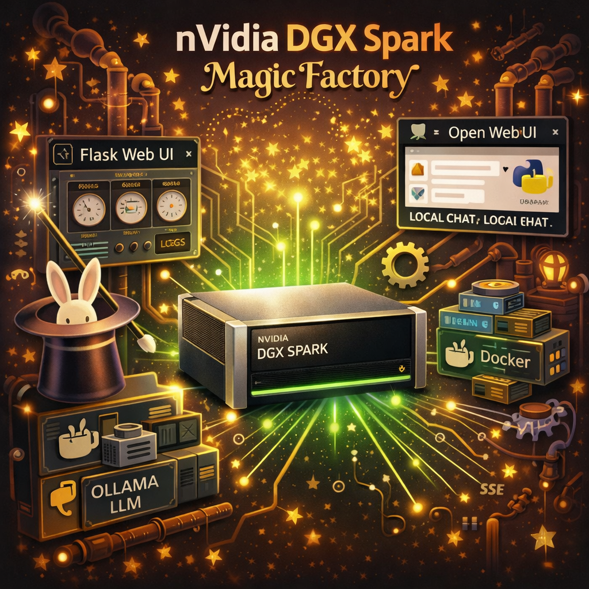

# ✨ NVIDIA DGX Spark Magic Factory

<p align="center">
  
</p>

Long-running build harness for DGX Spark local LLM setup.

Copyright 2026 Chris Morley / [Lantern Light AI](https://www.lanternlight.ai) — Made with :heart: with Claude Code, in Massachusetts

## Quick Start
```bash
git clone <repo-url> && cd nvidia-dgx-spark-magic-factory
export ANTHROPIC_API_KEY="sk-ant-..."   # optional but recommended
bin/start.sh
```
Open http://localhost:7711. Press the **Go** button to auto-run all steps.

## Magic Factory Chat (local UI)
After setup completes, Magic Factory Chat launches at http://localhost:7722.
You can also run it standalone:
```bash
python3 chat/chat.py --model qwen3-coder-next
```
Zero dependencies. No auth. No Docker. Direct to Ollama. 100% local.

## Stopping
```bash
bin/stop.sh     # stops harness, chat UI, and Open WebUI container
```

## Do NOT use sudo
If Docker needs permissions, the tool tells you the fix command.

## Architecture
- **Runs for days.** All stdout/stderr redirected to the web UI.
- **Immutable logs** in `data/logs/` — each session gets its own append-only .jsonl file. Never deleted.
- **Immutable research** in `data/research/` — Claude advice saved with timestamps. Never overwritten.
- **Immutable builds** in `data/builds/` — each export creates a new timestamped directory. Never modified (except to append health checks).
- **Duplicate detection** — builds with identical content (minus timestamps) are flagged via SHA256.
- **Periodic health checks** — background thread re-tests random builds every 6-12h. Degradation surfaced in UI.
- **Security scanning** — all commands checked against blocklist (curl|bash, rm -rf /, reverse shells, etc).
- **Human approval gate** — Claude-suggested replacement commands require explicit click to approve.
- **Localhost only** — Flask binds to 127.0.0.1. Use SSH tunnel for remote access.
- **Loop detection** — 2+ identical errors triggers escalation to Claude with full history.
- **Integrity endpoint** — `/api/integrity` returns SHA256 of all tool files.

---

## Author

**Chris Morley** — [Lantern Light AI](https://www.lanternlight.ai)

- :briefcase: chris.morley@lanternlight.ai
- :envelope: depahelix@gmail.com
- :globe_with_meridians: https://www.lanternlight.ai

Available for contracts and 100% remote work. If this project saved you time, imagine what a conversation could do.
